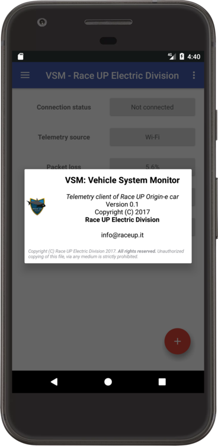
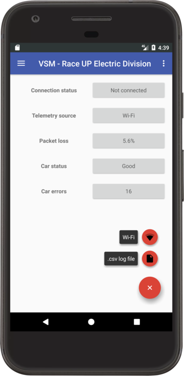
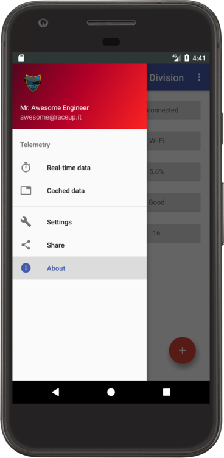
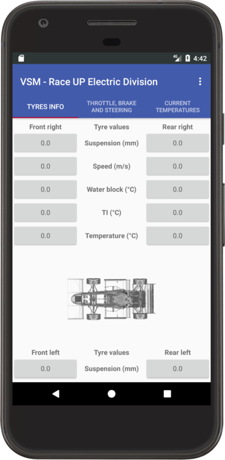
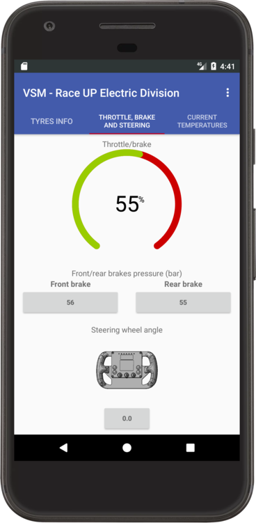

# Vsm App: Vehicle System Monitor Android App
*Official Race UP telemetry app for Android devices*

## Usage
1. Have an Origin-e car made by Race UP
2. Connect a Raspberry Pi to the car can-bus and broadcast data via Wi-Fi
3. Open the app and tap to *Add a telemetry source*, choose `Wi-Fi`

## Information provided
The home page shows important info about connection in use and the car status.

The home page menu redirects the user to various sub-activities ... for example the [RealTimeActivity](vsm/app/src/main/java/org/raceup/ed/telemetry/vsm/activity/RealTimeTelemetryActivity.java) present the user with 3 tabs:
- the first tab to get current status of the tyres
- the second one to get info about the pilot's input (i.e throttle, brakes ...)
- the last one to get info about car tyres and engines temperatures

## Where can I try it
As for now, there is no `Race UP` GooglePlay developer, neither an app provided in the `Play Store`, however you can [download](https://github.com/raceup/telemetry-android-client/blob/master/vsm/app/build/outputs/apk/app-debug.apk?raw=true) it from here!

## License
[Apache License](http://www.apache.org/licenses/LICENSE-2.0) Version 2.0, January 2004
